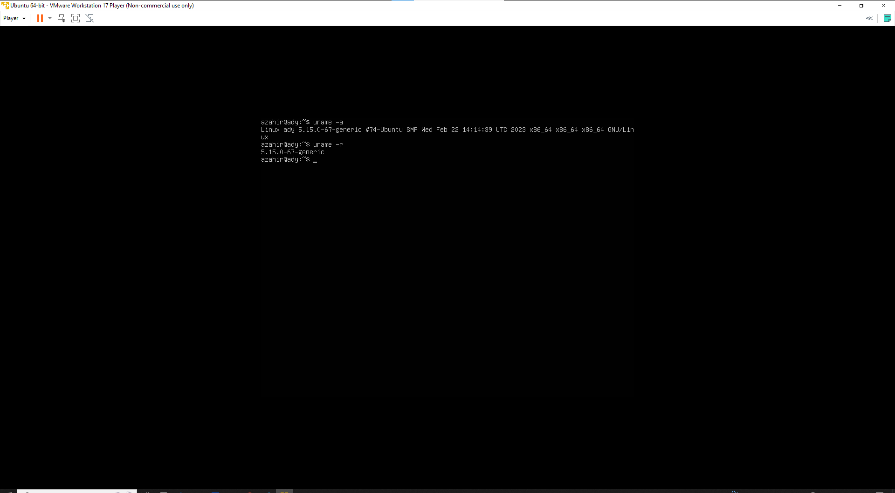

# Laporan Workshop Administrasi Jaringan

### Nama : Achmad Zahir Wajdi

### NRP : 3121600012

### Kelas : 2 D4 Teknik Informatika A

### Link github: https://github.com/Azahir21/WAJ

# 1. Identifikasi Kernel

### 1.1 Definisi Kernel

Kernel adalah komponen utama dari sistem operasi yang mengelola operasi komputer dan perangkat keras. Ini pada dasarnya mengelola operasi memori dan waktu CPU. Ini adalah komponen inti dari sistem operasi. Kernel bertindak sebagai jembatan antara aplikasi dan pemrosesan data yang dilakukan pada tingkat perangkat keras menggunakan komunikasi antar proses dan panggilan sistem.

Kernel memuat terlebih dahulu ke dalam memori saat sistem operasi dimuat dan tetap berada di dalam memori hingga sistem operasi dimatikan lagi. Ini bertanggung jawab untuk berbagai tugas seperti manajemen disk, manajemen tugas, dan manajemen memori.

Kernel memiliki tabel proses yang melacak semua proses yang aktif

- Tabel proses berisi tabel wilayah per proses yang titik masuknya ke entri dalam tabel wilayah.

Kernel memuat file yang dapat dieksekusi ke dalam memori selama panggilan sistem 'exec'.

Ini memutuskan proses mana yang harus dialokasikan ke prosesor untuk dieksekusi dan proses mana yang harus disimpan di memori utama untuk dieksekusi. Ini pada dasarnya bertindak sebagai antarmuka antara aplikasi pengguna dan perangkat keras. Tujuan utama kernel adalah untuk mengelola komunikasi antara perangkat lunak yaitu aplikasi tingkat pengguna dan perangkat keras yaitu CPU dan memori disk.

### 1.2 Fungsi Kernel

- Untuk membangun komunikasi antara aplikasi tingkat pengguna dan perangkat keras.
- Untuk memutuskan keadaan proses yang masuk.
- Untuk mengontrol manajemen disk.
- Untuk mengontrol manajemen memori.
- Untuk mengontrol manajemen tugas.

### 1.3 Jenis-jenis Kernel

1. Monolithic kernel

   salah satu jenis kernel dimana semua layanan sistem operasi beroperasi di ruang kernel. Ini memiliki ketergantungan antara komponen sistem. Ini memiliki garis besar kode yang kompleks.

2. Micro kernel

   jenis kernel yang memiliki pendekatan minimalis. Ini memiliki memori virtual dan penjadwalan utas. Ini lebih stabil dengan lebih sedikit layanan di ruang kernel. Itu menempatkan istirahat di ruang pengguna.

3. Hybrid kernel

   kombinasi dari kernel monolitik dan mikrokernel. Ini memiliki kecepatan dan desain kernel monolitik dan modularitas dan stabilitas microkernel.

4. Exo kernel

   jenis kernel yang mengikuti prinsip end-to-end. Ini memiliki abstraksi perangkat keras sesedikit mungkin. Ini mengalokasikan sumber daya fisik ke aplikasi.

5. Nano kernel

   jenis kernel yang menawarkan abstraksi perangkat keras tetapi tanpa layanan sistem. Kernel Mikro juga tidak memiliki layanan sistem sehingga Kernel Mikro dan Kernel Nano menjadi analog.

### 1.4 Identifikasi Kernel pada device saya

uname -a untuk menampilkan semua informasi tentang sistem seperti nama host, versi kernel, arsitektur sistem, platform sistem operasi, tanggal dan waktu kompilasi kernel, dll.

uname -r hanya menampilkan nomor versi kernel yang sedang berjalan pada sistem.

##### Penjelasan

Dalam versi kernel saya 5.15.0-67, ini menunjukkan versi kernel Ubuntu yang digunakan. Versi kernel ini adalah 5.15.0-67, di mana:

- 5 adalah nomor utama kernel, yang menunjukkan bahwa ini adalah kernel seri 5.

- 15 adalah nomor minor kernel, yang menunjukkan bahwa ini adalah kernel seri 15 dari seri 5.

- 0 adalah nomor revisi kernel, yang menunjukkan bahwa ini adalah revisi pertama dari kernel seri 15.

- 67 adalah nomor pembangunan kernel, yang menunjukkan bahwa ini adalah build ke-67 dari revisi pertama dari kernel seri 15.

# 2. Identifikasi Kernel

(root) : merupakan induk dari susunan direktori di linux dan merupakan tempat dimana semua direktori berada.

/bin/ : directory ini berisi progam perintah esensial yang dibutuhkan oleh semua user. progam-progam disini dapat dijalankan, meskipun tidak ada sistem file lain yang di mount. Directory ini tidak memiliki subdirectory.

/boot/ : merupakan direktori yang berfungsi untuk menyimpan konfigurasi dan file-file yang berhubungan dengan proses booting, memuat Linux Kernel dan file lain yang diperlukan LILO dan GRUB boot manager.

/dev/ : merupakan direktori yang berfungsi untuk menyimpan konfigurasi device atau hardware dari sistem, seperti harddisk (hda, sda), terminal (tty) etc.

/etc/ : merupakan direktori yang berfungsi untuk menyimpan skrip installation pada /etc/rc.d subdirektory dan file-file konfigurasi dari sistem, misalkan konfigurasi service, penjadwalan etc.

/home/: berfungsi untuk menyimpan data/dokumen untuk user yang ada di komputer linux.

/root/ (root directory) : adalah struktur paling dasar yang harus bisa melakukan boot, perbaikan atau mengembalikan sistem seperti dalam keadaan semula.

/lib/ : merupakan direktori yang berfungsi untuk menyimpan library dasar dari system termasuk modul driver yang dapat diisi pada sistem boot.

/media/ : direktori yang berfungsi untuk mounting removable media seperi drive CD-ROM, floopy disk etc.

/opt/ : merupakan direktori yang berfungsi untuk menyimpan aplikasi tambahan diluar aplikasi bawaan dari linux.

/sbin/ : merupakan direktori yang berfungsi untuk menyimpan aplikasi dasar dari linux yang dijalankan oleh super user (root) misalnya mount, shutdown, umount.

/usr/ : merupakan direktori untuk menyimpan aplikasi yang diinstall oleh user, misalkan OpenOffice, Kate , chrome dan sebagainya.

/var/ : merupakan direktori untuk menyimpan informasi pencatatan log sistem, web server, mailbox dan data-data aplikasi.

/tmp/ : berisi file-file sementara yang dibutuhkan sebuah aplikasi yang sedang berjalan.

/mnt/ : yang berisikan mount point tempat untuk kamu memasang floopy-disk dan CD-ROM.

/srv/ : direktori yang berisikan data atau service yang dibutuhkan oleh sebuah server misalnya,menjalankan FTP server.

# 3. Perbedaan sudo dan su

SU adalah singkatan dari Switch User bukan Super User, jadi dengan perintah ini kita dapat merubah user kita dan user1 ke user2 didalam sebuah system Tetapi jika kalian menggtikan "su tanpa nama user yang lain dibelakangnya maka secara default system akan mengganti user biasa menjadi Super User

Sudo merupakan singkatan dari Super User Do, fungsi dari perintah ini adalah kita meminta ijin agar kita dijinkan untuk menjalankan perintah superuser dengan mengunakan user biasa sebagaimana ditentukan oleh kebijakan keamanan

Sudo Su adalah sebuah perintah dalam command-line Linux. Apabila kalian memiliki akses root, maka sudo akan melakukan perintah sebagai superuser "sudo su memberikan kewenangan agar user biasa dapat bertingkah seperti super user (sudo-> super user do) sehingga user biasa pun dapat leluasa "menguasai sistem". Dan perintah ini berlaku sampai kita yang menutup terminal, tidak seperti perintah pada sudo

# 4. Repositori di linux

### 4.1 Definisi Repositori

Repositori Linux adalah lokasi penyimpanan tempat sistem Anda menginstal pembaruan dan aplikasi OS. Setiap repositori adalah kumpulan perangkat lunak yang dihosting di remote server dan dimaksudkan untuk digunakan untuk menginstal dan memperbarui paket perangkat lunak.

### 4.2 Lokasi repositori

Di Ubuntu, semua distro berbasis Ubuntu, Debian, dan semua distro berbasis Debian, Anda dapat mengarsipkan daftar repos(repositori) di `/etc/apt/sources.list` . Anda dapat membuka file menggunakan nano seperti itu:

      sudo nano /etc/apt/sources.list

### 4.3 Macam-macam Repositori

1.  Main – Perangkat lunak bebas dan sumber terbuka yang didukung Canonical.
2.  Universe – Perangkat lunak bebas dan sumber terbuka yang dikelola komunitas.
3.  Restricted – Driver eksklusif untuk perangkat.
4.  Multiverse – Perangkat lunak dibatasi oleh hak cipta atau masalah hukum.

# 5. Perintah apt

Perintah apt adalah utilitas baris perintah untuk menginstal, memperbarui, menghapus dan mengelola paket deb di Ubuntu, Debian, dan distribusi Linux terkait. Perintah apt menghasilkan output yang sama dengan apt-get dan berkaitan erat dengan perintah apt-cache.

Basic syntax:

      apt command
      apt [options] command
      apt [options] command pkg1
      apt [options] command pkg1 pkg2

beberapa contoh apt command seperti berikut :
| Perintah | Fungsi |
| -------- | ------ |
| apt update | Memperbarui daftar paket dan metadata yang tersedia di repository. |
| apt upgrade | Menginstall paket-paket baru yang tersedia dan mengupgrade paket yang sudah terinstall. |
| apt install | Menginstall paket baru. |
| apt remove | Menghapus paket yang sudah terinstall. |
| apt autoremove | Menghapus paket-paket yang tidak lagi dibutuhkan oleh sistem. |
| apt search | Mencari paket yang tersedia di repository. |
| apt show | Menampilkan informasi detail tentang paket yang tersedia di repository. |
| apt list | Menampilkan daftar paket yang sudah terinstall. |
| apt full-upgrade | Menginstall paket-paket baru dan mengupgrade paket-paket yang sudah terinstall dengan menyelesaikan semua ketergantungan (dependencies) yang dibutuhkan. |
| list | Menampilkan daftar paket berdasarkan nama paket |
| search | Mencari dalam deskripsi paket |
| show | Menampilkan detail paket |
| install | Menginstall paket |
| reinstall | Menginstall ulang paket |
| remove | Menghapus paket |
| autoremove | Menghapus otomatis semua paket yang tidak terpakai |
| update | Memperbarui daftar paket yang tersedia |
| upgrade | Mengupgrade sistem dengan menginstal/mengupgrade paket-paket |
| full-upgrade | Mengupgrade sistem dengan menghapus/menginstal/mengupgrade paket-paket |
| edit-sources | Mengedit file informasi sumber |
| satisfy | Memenuhi string dependensi |
